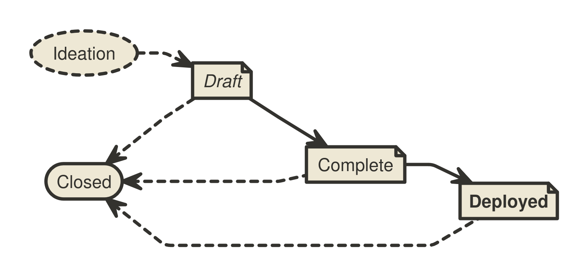

```
  AIP: 1
  Title: AIP Purpose, Process, and Guidelines
  Authors: Chuck McClish <autonomi@mcclish.io>
  Comments-URI: https://forum.autonomi.community/t/community-call-to-action-proposal-to-form-an-autonomi-developer-council/41747/44
  Status: Proposed
  Type: Process
  Created: 2025-05-17
  License: BSD-2-Clause
```

## Abstract

This _Autonomi Improvement Proposal (AIP)_ provides information about the preparation of AIPs and policies relating to
the publication of AIPs. It very closely matches [BIP 3](https://github.com/bitcoin/bips/blob/master/bip-0003.md) from the _Bitcoin Improvement Process_ descriptiont. This proposal may be amended to
address the evolving needs of the AIP process.

## Motivation

The Autonomi network has been released and is now live. The first round of applications are being developed as of this initial writing and it has become necessary to implement standards and processes to maintain the network from the community perspective. The AIP process codifies the workflows and processes to help guide the fledgling network and its community from development to production.

## Fundamentals

### What is an AIP?

AIPs cover the range of interests of the Autonomi community. The main topic is information and technologies that support and expand the utility of the Autonomi network.
Most AIPs provide a concise, self-contained, technical description of one new concept, feature, or standard.
Some AIPs describe processes, implementation guidelines, best practices, incident reports, or other information relevant to the Autonomi community. However, any topics related to
the Autonomi core libraries, API's, and application software may be acceptable.

AIPs are intended to be a means for proposing new protocol features, coordinating application standards, and
documenting design decisions that have gone into implementations. AIPs may be submitted by anyone.

The scope of the AIP
repository is limited to AIPs that do not oppose the fundamental principle that Autonomi is a network controlled by no one but owned by everyone.

### AIP Ownership

Each AIP is primarily owned by its authors and represents the authors’ opinion or recommendation. The authors are
expected to foster discussion, address feedback and dissenting opinions, and, if applicable, advance the adoption of
their proposal within the Autonomi community. As a AIP progresses through the workflow, it becomes increasingly
 co-owned by the Autonomi community.

#### Authors and Deputies

Authors may want additional help with the AIP process after writing an initial draft. In that case, they may assign
one or more Deputies to their AIP. Deputies are stand-in owners of an AIP who were not involved in writing the
document. They support the authors in advancing the proposal, or act as a point of contact for the AIP in the absence of the
authors. Deputies may perform the role of Authors for any aspect of the AIP process unless overruled by an Author.
Deputies share ownership of the AIP at the discretion of the Authors.

### What is the Significance of AIPs?

AIPs do not define what Autonomi is: individual AIPs do not represent Autonomi community consensus or a general
recommendation for implementation. An AIP represents a personal recommendation by the AIP authors to the Autonomi
community. Some AIPs may never be adopted. Some AIPs may be adopted by one or more Autonomi applications or other related
software. Some may even end up changing the rules that the Autonomi network enforces.

### What is the Purpose of the AIPs Repository?

The [AIPs repository](https://github.com/safenetforum-community/aips) serves as a publication medium and archive for mature proposals.
Through its high visibility, it facilitates the community-wide consideration of AIPs and provides a well-established
source to retrieve the latest version of any AIP. The repository transparently records all changes to each AIP and
allows any community member to retain a complete copy of the archive easily.

The AIPs repository is not a tool to track acceptance, adoption, or community consensus on AIPs, beyond
providing a brief overview of AIP statuses (see [Workflow](#workflow) below) to the audience.
There is no formal or informal decision body that decides acceptance of AIPs.
Autonomi development is performed by the MaidSafe company and from the participation of stakeholders across the ecosystem.

## AIP Format and Structure

### Specification

Authors may choose to submit AIPs in MediaWiki or Markdown[^markdown] format.

Each AIP must have a _Preamble_, an _Abstract_, a _Copyright_, and a _Motivation_ section. Authors should consider all issues in the
following list and address each as appropriate.

* Preamble — Headers containing metadata about the AIP (see the section [AIP Header Preamble](#aip-header-preamble)
  below).
* Abstract — A short description of the issue being addressed.
* Motivation — Why is this AIP being written? Clearly explain how the existing situation presents a problem and why the proposed idea resolves the
  issue or improves upon the current situation.
* Specification — The technical specification should describe the syntax and semantics of any new feature. The
  specification should be detailed enough to enable any Autonomi application to create an interoperable implementation.
* Rationale — The rationale fleshes out the specification by describing what inspired the design and why particular
  design decisions were made. It should describe related work and alternate designs that were considered. The rationale
  should record relevant objections or important concerns that were raised and addressed as this proposal was developed.
* Backward Compatibility — Any AIP that introduces incompatibilities must include a section describing these incompatibilities and their severity as well as provide instructions on how
  implementers and users should deal with these incompatibilities.
* Reference Implementation — Where applicable, a reference implementation, test vectors, and documentation must be
  finished before the AIP can be given the status "Complete". Test vectors must be provided in the AIP or
  as auxiliary files (see [Auxiliary Files](#auxiliary-files)) under an acceptable license. The reference implementation can be provided in the AIP, as an auxiliary file, or per reference to a pull request that is expected to remain available permanently.
* Changelog — A section to track modifications to an AIP after reaching Complete status.
* Copyright — The AIP must be placed under an acceptable license (see [AIP Licensing](#aip-licensing) below).

#### AIP Header Preamble

Each AIP must begin with an [RFC 822-style header preamble](https://www.w3.org/Protocols/rfc822/). The headers must
appear in the following order. Headers marked with "\*" are optional. All other headers are required.

##### Overview

```
  AIP: <AIP number, or "?">
* Layer: < Network | API | Applications >
  Title: <AIP title (≤ 50 characters)>
  Authors: <Authors’ names and email addresses>
* Deputies: <Deputies’ names and email addresses>
* Comments: <URL of comments location>
  Status: <Draft | Complete | Deployed | Closed>
  Type: <Specification | Informational | Process>
  Created: <Date of number assignment (yyyy-mm-dd), or "?">
  License: <Identifier(s) of acceptable license(s)>
* License-Code: <Identifier(s) for Code under different acceptable license(s)>
* Discussion: <Noteworthy discussion threads in "yyyy-mm-dd: URL" format>
* Version: <MAJOR.MINOR.PATCH>
* Requires: <AIP number(s)>
* Replaces: <AIP number(s)>
* Proposed-Replacement: <AIP number(s)>
```

##### Header Descriptions

* AIP — The assigned number of the AIP. Please use "?" before a number has been assigned by the AIP Editors.
* Layer — The layer of Autonomi the AIP applies to using the AIP classification defined in the [Layers](#layers) section below.
* Authors — The names (or pseudonyms) and email addresses of all authors of the AIP. The format of each authors header
  value must be

      Random J. User <address@dom.ain>

  Multiple authors are recorded on separate lines:

      Authors: Random J. User <address@dom.ain>
               Anata Sample <anata@domain.example>

* Deputies — Additional owners of the AIP that are not authors. The Deputies header uses the same format as the
  Authors header. See the [AIP Ownership](#aip-ownership) section above.
* Status — The stage of the workflow of the proposal. See the [Workflow](#workflow) section below.
* Type — See the [AIP Types](#aip-types) section below for a description of the three AIP types.
* License and License-Code — These headers list SPDX License Identifier(s) of the acceptable licenses under which the
  AIP and corresponding code are available. See the [AIP Licensing](#aip-licensing) section below for a description of
  the Licenses and their SPDX License Identifiers. If there are multiple acceptable licenses, each should be on a
  separate line.
* Discussion — The Discussion header points the audience to relevant discussions of the AIP, e.g., the mailing list
  thread in which the idea for the AIP was discussed, a thread where a new version of the AIP was presented, or relevant
  discussion threads on other platforms. Entries take the format "yyyy-mm-dd: URL", e.g., `2025-02-11:
  https://forum.autonomi.community/t/decades-in-the-making-our-network-breaks-free/41166`, using the date and URL of the start of the
  conversation. Multiple discussions should be listed on separate lines.
* Version — The current version number of this AIP. See the [Changelog](#changelog) section below.
* Requires — A list of existing AIPs the new proposal depends on. If multiple AIPs
  are required, they should be listed in one line separated by a comma and space (e.g., "1, 2").
* Replaces — AIP authors may place the numbers of one or more prior AIPs in the Replaces header to recommend that their
  AIP succeeds, supersedes, or renders obsolete those prior AIPs.
* Proposed-Replacement — When a later AIP indicates that it intends to supersede an
  existing AIP, the later AIP’s number is added to the Proposed-Replacement header of the existing AIP to indicate the
  potential successor AIP.

#### Auxiliary Files

AIPs may include auxiliary files such as diagrams and source code. Auxiliary files must be included in a subdirectory
for that AIP named `aip-XXXX`, where "XXXX" is the AIP number zero-padded to four digits. File names in the subdirectory
do not need to adhere to a specific convention.

### AIP Types

* A **Specification AIP** defines a set of technical rules describing a new feature or affecting the interoperability of implementations. The
  distinguishing characteristic of a Specification AIP is that it can be implemented, and implementations can be compliant with
  it. Specification AIPs must have a Specification section, must have a Backward Compatibility section (if incompatibilities are introduced), and can only be advanced to Complete after they contain or refer to a reference implementation and test vectors.
* An **Informational AIP** describes a Autonomi design issue, or provides general guidelines or other information to the
  Autonomi community.
* A **Process AIP** describes a process surrounding Autonomi, or proposes a change to (or an event in) a process. Process
  AIPs are like Specification AIPs, but apply to topics other than the Autonomi protocol and Autonomi implementations.
  They often require community consensus and are typically binding for the corresponding process. Examples include
  procedures, guidelines, and changes to decision-making processes such as the AIP Process.

## Layers

Autonomi is a system involving a number of different standards. Some standards are absolute requirements for interoperability while others can be considered optional, giving implementers a choice of whether to support them.

In order to have an AIP process which more closely reflects the interoperability requirements, it is necessary to categorize AIPs accordingly. Lower layers present considerably greater challenges in getting standards accepted and deployed.

### Specification

Standards AIPs are placed in one of four layers:

* Network
* API
* Applications

Non-standards AIPs may be placed in these layers, or none at all.

#### Network

The network layer defines the core functionality of the Autonomi network.

**FIXME: need to flesh this out more, discuss potential network forks?**

#### API Layer

The API layer specifies higher level calls accessible to applications. Support for these AIPs is not required for basic network interoperability but might be expected by some network applications.

There's room at this layer to allow for competing standards without breaking basic network interoperability.

#### Applications Layer

The applications layer specifies high level structures, abstractions, and conventions that allow different applications to support similar features and share data.

## Workflow

The AIP process starts with a new idea for Autonomi. Each potential AIP must have authors—people who write the AIP,
gather feedback, shepherd the discussion in the appropriate forums, and finally recommend a mature proposal to the
community.



### Ideation

After having an idea, the authors should evaluate whether it meets the criteria to become an AIP, as described in this
AIP. The idea must be of interest to the broader community or relevant to multiple software projects. Minor improvements
and matters concerning only a single project usually do not require standardization and should instead be brought up directly to
the relevant project.

The authors should first research whether an idea has been considered before. Ideas in Autonomi are often rediscovered,
and prior related discussions may inform the authors of the issues that may arise in its progression. After some investigation,
the novelty of an idea can be tested by posting about it to the [Autonomi Forum](https://forum.autonomi.community/).

Vetting an idea publicly before investing the time to describe the idea formally is meant to save both the authors and
the broader community time. Not only may someone point out relevant discussion topics that were missed in the authors’
research, or that an idea is guaranteed to be rejected based on prior discussions, but describing an idea publicly also
tests whether it is of interest to more people besides the authors. After establishing that the idea may be of interest
to the Autonomi community, the authors should work on drafting an AIP.

As a first sketch of the proposal is taking shape, the authors should present it to the [Autonomi Forum](https://forum.autonomi.community/).
This gives the authors a chance to collect initial feedback and address
fundamental concerns. If the authors wish to work in public on the proposal at this stage, it is recommended that they
open a pull request against one of their forks of the AIPs repository instead of the main AIPs repository.

It is recommended that complicated proposals be split into separate AIPs that each focus on a specific component of the
overall proposal.

### Progression through AIP Statuses

The following sections refer to AIP Status Field values. The AIP Status Field is defined in the Header Preamble
specification above.

#### Draft

After fleshing out the proposal further and ensuring that it is of high quality and properly formatted, the authors
should open a pull request to the [AIPs repository](https://github.com/safenetforum-community/aips). The document must adhere to the
formatting requirements specified above and should be provided as a file named with a working title of the form
"aip-title.[md|mediawiki]". The authors must not self-assign a number to their proposal.

AIPs that (1) adhere to the formatting requirements, (2) are on-topic, and (3) have materially progressed beyond the
ideation phase, e.g., by generating substantial public discussion and commentary from diverse contributors, by
independent Autonomi projects working on adopting the proposal, or by the authors working for an extended period toward
improving the proposal based on community feedback, will be assigned a number by an AIP editor. The AIP editors should
delay number assignment when they perceive a proposal being met with lack of interest: number assignment facilitates the
distributed discussion of ideas, but before a proposal garners some interest in the Autonomi community, there is no need
to refer to it by a number.

Proposals are also not ready for number assignment if they duplicate efforts, disregard formatting rules, are too
unfocused or too broad, fail to provide proper motivation, fail to address backward compatibility where necessary, or
fail to specify the feature clearly and comprehensively. Reviewers and AIP editors should provide guidance on how the
proposal may be improved to progress toward readiness. Pull requests that are proposing off-topic ideas or
have stopped making progress may be closed.

When the proposal is ready and has been assigned a number, an AIP editor will merge it into the AIPs repository. After the
AIP has been merged to the repository, its main focus should no longer shift significantly, even while the authors may
continue to update the proposal as necessary. Updates to merged documents by the authors should also be submitted as
pull requests.

#### Complete

When the authors have concluded all planned work on their proposal, are confident that their AIP represents a net
improvement, is clear, comprehensive, and is
ready for adoption by the Autonomi community, they may update the AIP’s status to Complete to indicate that they
recommend adoption, implementation, or deployment of the AIP. Where applicable, the authors must ensure that any
proposed specification is solid, not unduly complicated, and definitive. Specification AIPs must come with or refer
to a working reference implementation and comprehensive test vectors before they can be moved to Complete. Subsequently, the AIP’s content should only be
adjusted in minor details, e.g., to improve language, clarify ambiguities, backfill omissions in the specification, add
test vectors for edge cases, or address other issues discovered as the AIP is being adopted.

A Complete AIP can only move to Deployed or Closed. Any necessary changes to the specification should be minimal and
interfere as little as possible with ongoing adoption. If a Complete AIP is found to need substantial functional
changes, it may be preferable to move it to Closed[^new-AIP], and to start a new AIP with the changes instead.
Otherwise, it could cause confusion as to what being compliant with the AIP means.

An AIP may remain in the Complete status indefinitely unless its authors decide to move it to Closed or it is advanced to
Deployed.
Complete is the final status for most successful Informational AIPs.

#### Deployed

A settled[^settled] AIP may be advanced to Deployed upon request by any community member with evidence[^evidence] that the idea
described in the AIP is in active use. Convincing evidence includes for example: an established project having deployed support
for the AIP in mainnet software releases, a soft fork proposal’s activation criteria having been met on the network, or
rough consensus for the AIP having been demonstrated.

At that point, the AIP should be considered final and any breaking changes to the AIP should be proposed as a new
separate AIP.[^new-AIP]

##### Process AIPs

A Process AIP may change status from Complete to Deployed when it achieves rough consensus on the Autonomi Forum. Such a
proposal is said to have rough consensus if it has been open to discussion on the forum for at least
one month, and no person maintains any unaddressed substantiated objections to it. Addressed or obstructive objections
may be ignored/overruled by general agreement that they have been sufficiently addressed, but clear reasoning must be
given in such circumstances. Deployed Process AIPs may be modified indefinitely as long as a proposed modification has
rough consensus per the same criteria.[^living-documents]

#### Closed

An AIP that is of historical interest only, and is not being actively worked on, promoted or in active use, should be
marked as Closed. The reason for moving the
proposal to (or from) Closed should be recorded in the Changelog section in the same commit that updates the status.
AIPs do not get deleted, they are retained even after being updated to Closed.
Transitions involving the Closed state are:

##### Draft ↦ Closed

AIP authors may decide on their own to change their AIP’s status from Draft to Closed. If a Draft AIP stops making
progress, sees accumulated feedback unaddressed, or otherwise appears stalled for a year, the community may move the AIP
to Closed unless the authors assert that they intend to continue work within four weeks of being contacted.

##### Complete ↦ Closed

AIPs that had attained the Complete status, i.e., that had been recommended for adoption, may be moved to Closed per the
authors’ announcement to the Autonomi Forum. However, if someone volunteers to adopt the proposal
within four weeks, they become the AIP's author or deputy (see [Transferring AIP Ownership](#transferring-aip-ownership) below), and the AIP will
remain Complete instead.

##### Deployed ↦ Closed

A AIP may evolve from Deployed to Closed when it is no longer in active use. Any community member may initiate this
Status update by announcing it to the Autonomi Forum, and proceed if no objections have been raised for four weeks.

##### Closed ↦ Draft

The Closed status is generally intended to be a final status for AIPs,
and if AIP authors decide to make another attempt at a previously Closed AIP, it is generally recommended to create a new
proposal. (Obviously, the authors may borrow any amount of inspiration or actual text from any prior AIPs as licensing
permits.) The authors should take special care to address the issues that caused the prior attempt’s abandonment. Even
if the prior attempt had been assigned a number, the new AIP will generally be assigned a distinct number. However, if it is
obvious that the new attempt directly continues work on the same idea, it may be reasonable to return the
Closed AIP to Draft status.

### Changelog

To help implementers understand updates to an AIP, any changes after it has reached Complete must be tracked with version,
date, and description in a Changelog section sorted by most recent version first. The version number is inspired by semantic versioning (MAJOR.MINOR.PATCH).
The MAJOR version is incremented if changes to the AIP’s Specification are introduced that are incompatible with prior
versions (which should be rare after an AIP is Complete, and only happen in well-grounded exceptional cases to an AIP that
is Deployed). The MINOR version is incremented whenever the specification of the AIP is changed or extended in a
backward-compatible way. The PATCH version is incremented for other changes to the AIP that are noteworthy (bug fixes,
test vectors, important clarifications, etc.). Version 1.0.0 is used to label the promotion to
Complete. A Changelog section may be introduced during the Draft phase to record significant changes (using versions 0.x.y).

Example:

> __Changelog__
>
> * __2.0.0__ (2025-01-22):
>     * Introduce a breaking change in the specification to fix a bug.
> * __1.1.0__ (2025-01-17):
>     * Add a backward compatible extension to the AIP.
> * __1.0.1__ (2025-01-15):
>     * Clarify an edge case and add corresponding test vectors.
> * __1.0.0__ (2025-01-14):
>     * Complete planned work on the AIP.

After an AIP receives a Changelog, the
Preamble must indicate the latest version in the Version header. The Changelog highlights revisions to AIPs to human readers. A single
AIP shall not recommend more than one variant of an idea at the same time. A different or
competing variant of an existing AIP must be published as a separate AIP.

### Adoption of Proposals

The AIPs repository does not track the sentiment on proposals and does not track the adoption of AIPs beyond whether they
are in active use or not. It is not intended for AIPs to list additional implementations beyond the reference
implementation: the AIPs repository is not a signpost where to find implementations. After an AIP
is advanced to Complete, it is up to the Autonomi community to evaluate, adopt, ignore, or reject an AIP. Individual
Autonomi projects are encouraged to publish a list of AIPs they implement.

### Transferring AIP Ownership

It occasionally becomes necessary to transfer ownership of AIPs to new owners. In general, it would be preferable to
retain the original authors of the transferred AIP, but that is up to the original authors. A good reason to transfer
ownership is because the original authors no longer have the time or interest in updating it or following through with
the AIP process, or are unreachable or unresponsive. A bad reason
to transfer ownership is because someone doesn't agree with the direction of the AIP. The community tries to build
consensus around an AIP, but if that's not possible, rather than fighting over control, the dissenters should supply a
competing AIP.

If someone is interested in assuming ownership of an AIP, they should send an email asking to take over, addressed to the
original authors, the AIP Editors, and the Autonomi Forum. If the authors are unreachable or do not respond in a timely
manner (e.g., four weeks), the AIP editors will make a unilateral decision whether to appoint the applicants as
[Authors or Deputies](#authors-and-deputies) (which may be amended should the original authors make a delayed reappearance).

## AIP Licensing

Autonomi develops a global autonomous data storage and retrieval system. Open standards are indispensable for continued
interoperability. Open standards reduce friction, and encourage anybody and everyone to contribute, compete, and
innovate on a level playing field. Only freely licensed contributions are accepted to the AIPs repository.

### Specification

Each new AIP must identify at least one acceptable license in its preamble. Licenses must be referenced per their
respective [SPDX License identifier](https://spdx.org/licenses). New AIPs may be accepted with the licenses described
below.

For example, a preamble might include the following License header:

    License: CC0-1.0
             GNU-All-Permissive

In this case, the AIP text is fully licensed under both the Creative Commons CC0 1.0 Universal license as well as the
GNU All-Permissive License, and anyone may modify and redistribute the text provided they comply with the terms of
*either* license. In other words, the license list is an "OR choice", not an "AND also" requirement.

It is also possible to license source code differently from the AIP text by including the optional License-Code header
after the License header. Again, each license must be referenced by their respective SPDX License identifier shown
below.

Each source code file or source directory should specify the license under which it is made available as is common in
software (e.g., with a license header or a LICENSE/COPYING file). It is recommended to make any test vectors available
under CC0-1.0 or GNU-All-Permissive in addition to any other licenses to allow anyone to copy test vectors into their
implementations without introducing license hindrances. Licenses listed in the License-Code header apply to all source
directories, source code files, and test vectors provided with the AIP except those where a LICENSE file in a directory
or the file header states otherwise.

For example, a preamble specifying the optional License-Code header might look like:

    License:         CC0-1.0
    License-Code:    MIT

In this case, the code in the AIP is not available under CC0-1.0, but is only available under the terms of the MIT
License.

AIPs are not required to be *exclusively* licensed under approved terms, and may also be licensed under unacceptable
licenses *in addition to* at least one acceptable license. In this case, only the acceptable license(s) should be listed
in the License and License-Code headers.

It is recommended that AIPs that include literal code be licensed under the same license terms as the project it
modifies. For example, literal code intended for Autonomi would ideally be licensed under the GNU GPL3
license terms.

In all cases, details of the licensing terms must be provided in the Copyright section of the AIP.

#### Acceptable Licenses[^licenses]

**FIXME: need to review acceptable license list**

* BSD-2-Clause: [OSI-approved BSD 2-clause license](https://opensource.org/licenses/BSD-2-Clause)
* BSD-3-Clause: [OSI-approved BSD 3-clause license](https://opensource.org/licenses/BSD-3-Clause)
* CC0-1.0: [Creative Commons CC0 1.0 Universal](https://creativecommons.org/publicdomain/zero/1.0/)
* GNU-All-Permissive: [GNU All-Permissive License](http://www.gnu.org/prep/maintain/html_node/License-Notices-for-Other-Files.html)
* CC-BY-4.0: [Creative Commons Attribution 4.0 International](https://creativecommons.org/licenses/by/4.0/)
* MIT: [Expat/MIT/X11 license](https://opensource.org/licenses/MIT)
* Apache-2.0: [Apache License, version 2.0](http://www.apache.org/licenses/LICENSE-2.0)
* BSL-1.0: [Boost Software License, version 1.0](http://www.boost.org/LICENSE_1_0.txt)

#### Not Acceptable Licenses

All licenses not explicitly included in the above lists are not acceptable terms for a Autonomi Improvement Proposal.
However, AIPs predating the acceptance of this AIP were allowed under other terms, and should use these abbreviations
when no other license is granted:

* PD: Released into the public domain
* OPL: [Open Publication License, version 1.0](http://opencontent.org/openpub/)

## AIP Editors

The current AIP editors are:

* Chuck McClish ([autonomi@mcclish.io](mailto:autonomi@mcclish.io))

**FIXME: who do we want to add here?**

### AIP Editor Responsibilities and Workflow

The AIP editors subscribe to the Autonomi Forum and watch the [AIPs
repository](https://github.com/safenetforum-community/aips).

When a new AIP idea is submitted to the forum, AIP editors and other community members should comment in regard
to:

* Novelty of the idea
* Viability, utility, and relevance of the concept
* Readiness of the proposal
* On-topic for the Autonomi community

Discussion in pull request comments can often be hard to follow as feedback gets marked as resolved when it is addressed
by authors. Substantive discussion of ideas may be more accessible to a broader audience on the forum, where it
is also more likely to be retained by the community memory.

If the AIP needs more work, an editor should ensure that constructive, actionable feedback is provided to the authors
for revision. Once the AIP is ready it should be submitted as a "pull request" to the [AIPs
repository](https://github.com/safenetforum-community/aips) where it may get further feedback.

For each new AIP pull request that comes in, an editor checks the following:

* The idea has been previously discussed on the Autonomi Forum
* The described idea is on-topic for the repository
* Title accurately describes the content
* Proposal is of general interest and/or pertains to more than one Autonomi project/implementation
* Document is properly formatted
* Licensing terms are acceptable
* Motivation, Rationale, and Backward Compatibility have been addressed
* Specification provides sufficient detail for implementation
* The defined Layer header must be correctly assigned for the given specification
* The AIP is ready: it is comprehensible, technically feasible, and all aspects are addressed as necessary

Editors do NOT evaluate whether the proposal is likely to be adopted.

Then, an AIP editor will:

* Assign an AIP number and AIP type in the pull request
* Ensure that the AIP is listed in the [README](README.md)
* Merge the pull request when it is ready

The AIP editors are intended to fulfill administrative and editorial responsibilities. The AIP editors monitor AIP
changes, and update AIP headers as appropriate.

AIP editors may also, at their option, unilaterally make and merge strictly editorial changes to AIPs, such as
correcting misspellings, mending grammar mistakes, fixing broken links, etc. as long as they do not change the meaning or conflict with the
original intent of the authors. Such a change must be recorded in the Changelog if it’s noteworthy per the criteria
mentioned in the [Changelog](#changelog) section.

## Copyright

This AIP is licensed under the [BSD-2-Clause License](https://opensource.org/licenses/BSD-2-Clause). Much of the content was
adapted from [BIP 3](https://github.com/bitcoin/bips/blob/master/bip-0003.md) which was also licensed under the BSD-2-Clause.

## Related Work

- [BIP 3: Updated BIP Process](https://github.com/bitcoin/bips/blob/master/bip-0003.md)
- [BIP 123: BIP Classification](https://github.com/bitcoin/bips/blob/master/bip-0123.mediawiki)
- [RFC 822: Standard for ARPA Internet Text Messages](https://datatracker.ietf.org/doc/html/rfc822)
- [RFC 2223: Instructions to RFC Authors](https://datatracker.ietf.org/doc/html/rfc2223)
- [RFC 7282: On Consensus and Humming in the IETF](https://tools.ietf.org/html/rfc7282)

## Acknowledgements

We thank the Bitcoin Improvement Proposal team for providing the framework for this process. We also
thank the moderators and members of the Autonomi Forum for providing a place on the internet to discuss
all things Autonomi. Finally, we thank David Irvine and the MaidSafe team for developing the Autonomi network. Without
their perserverence we would not be here today.

## Rationale

[^markdown]: **Which flavor of Markdown is allowed?**  
    The author of this proposal has no opinion on Markdown flavors, but recommends that proposals stick to the basic
    Markdown syntax features commonly shared across Markdown dialects.
[^living-documents]: **Why are Process AIPs living documents?**  
    In the BIP process, the existing BIPs process had not always provided a clear approach to all situations. For
    example, the content of BIP 2 appears to have been penned especially with fork proposals in mind. It seems clear
    that Autonomi development will evolve in many surprising ways in the future. Instead of mandating the effort of
    writing a new process document every time new situations arise, it seems preferable to allow the process to adapt to
    the concerns of the future in specific aspects. Therefore, Process AIPs are defined as living documents that remain
    open to amendment. If a Process AIP requires large modifications or even a complete overhaul, a new AIP should be
    preferred.
[^new-AIP]: **Why should the specification of an implemented AIP not be changed?**  
    After a Complete or Deployed AIP has been deployed by one or more implementations, breaking changes to the
    specification could lead to a situation where multiple "compliant" implementations fail at being interoperable,
    because they implemented different versions of the same AIP. Therefore, even changes to the specification of
    Complete AIPs should be avoided, but Deployed AIPs should never be subject to breaking changes to their
    specification.
[^settled]: **What is meant by an AIP being settled?**  
    Since Deployed AIPs should not be changed, a Complete AIP should only be moved to Deployed after its Specification
    has been put through its paces and changes to the AIP have stopped.
[^evidence]: **How is evidence for advancing to Deployed evaluated?**  
    Whether evidence is deemed convincing to move an AIP to Deployed is up to the AIP Editors and Autonomi community.
    Running a single instance of a personal fork of a software project might be rejected, while a small software project with
    dozens of users may be sufficient. The main point of the Deployed status is to indicate that changes to the AIP
    could negatively impact users of projects that have already implemented support.
[^licenses]: **Why were some licenses dropped?**  
    Among the 141 BIPs with licenses in the Bitcoin Improvement Proposals repository, only nine licenses have ever been used to license BIPs
    (although, some BIPs were made available under more than one license) and only one license has been used to license
    code. It is expected that AIPs will likely follow the same format **FIXME: need to review these**:
    
    Licenses used:

    * BSD-2-Clause: 55
    * PD: 42
    * CC0-1.0: 23
    * BSD-3-Clause: 19
    * OPL: 5
    * CC-BY-SA-4.0: 4
    * GNU-All-Permissive: 3
    * MIT: 2
    * CC-BY-4.0: 1

    License-Code used:

    * MIT: 4

    The following previously acceptable licenses were retained per request of reviewers, even though they have so far
    never been used in the AIPs process:

    * Apache-2.0: [Apache License, version 2.0](http://www.apache.org/licenses/LICENSE-2.0)
    * BSL-1.0: [Boost Software License, version 1.0](http://www.boost.org/LICENSE_1_0.txt)

    The following previously acceptable licenses have never been used in the AIPs Process and have been dropped:

    * AGPL-3.0+: [GNU Affero General Public License (AGPL), version 3 or newer](http://www.gnu.org/licenses/agpl-3.0.en.html)
    * FDL-1.3: [GNU Free Documentation License, version 1.3](http://www.gnu.org/licenses/fdl-1.3.en.html)
    * GPL-2.0+: [GNU General Public License (GPL), version 2 or newer](http://www.gnu.org/licenses/old-licenses/gpl-2.0.en.html)
    * LGPL-2.1+: [GNU Lesser General Public License (LGPL), version 2.1 or newer](http://www.gnu.org/licenses/old-licenses/lgpl-2.1.en.html)

    Why are software licenses included?

    * Some AIPs, in particular those concerning the consensus layer, may include literal code in the AIP itself which
      may not be available under the license terms the authors wish to use for the AIP.
    * The author of this AIP has been provided with a learned opinion indicating that software licenses are perfectly
      acceptable for licensing "human code" i.e., text as well as Markdown or MediaWiki code.

    Why is CC-BY-SA-4.0 no longer acceptable for new AIPs?

    * Specification AIPs are required to have a Reference Implementation and Test Vectors to be advanced to Complete. As
      the AIPs repository is aiming to make proposals easily adoptable, the intention is for the reference
      implementation and test vectors to be as accessible as possible. Copyleft licenses may introduce friction here,
      and therefore CC-BY-SA-4.0 (and the GPL-flavors) is no longer considered acceptable for new AIPs. As mentioned
      above, existing AIPs will retain their original licensing.

    Why are OPL and Public Domain no longer acceptable for new AIPs?

    * Public domain is not universally recognised as a legitimate action, thus it is inadvisable.
    * The OPL is generally regarded as obsolete, and not a license suitable for new publications.
